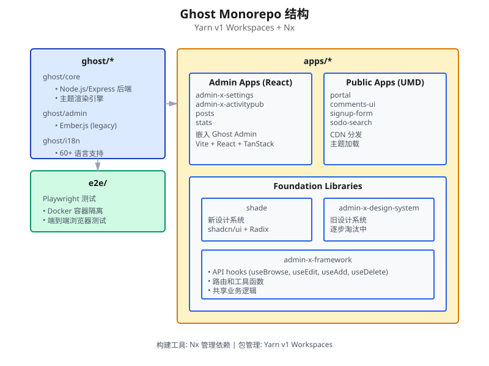
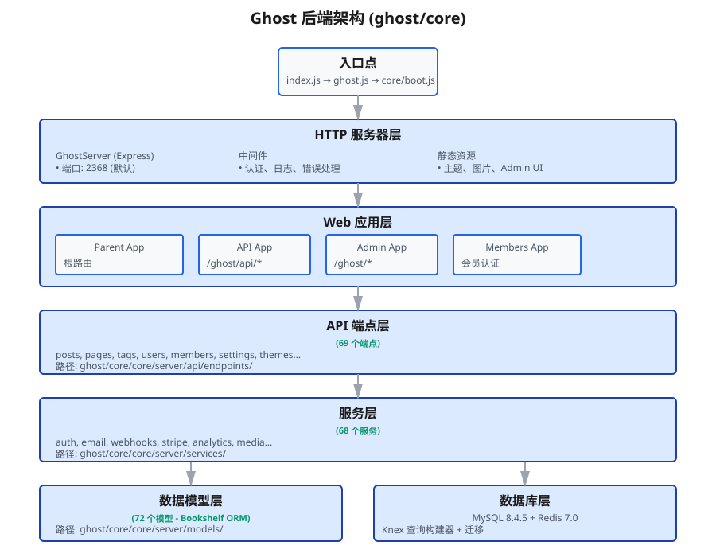
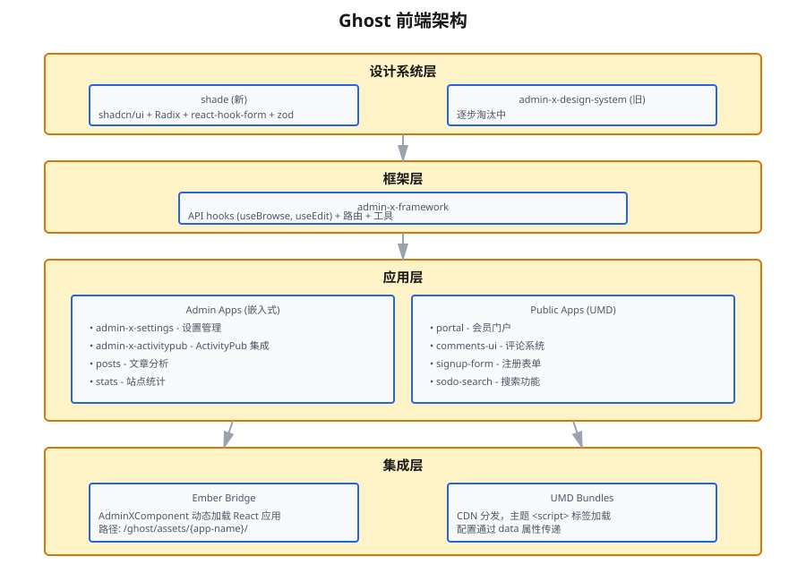
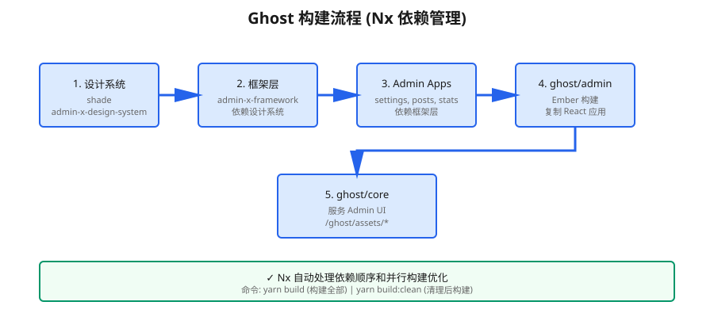
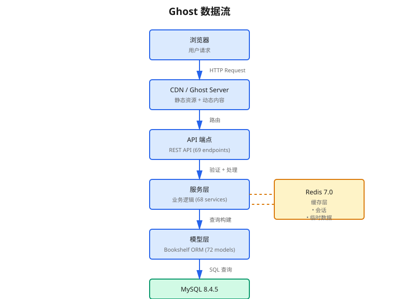

# Ghost 项目概览文档

> 最后更新: 2026-03-18

## 目录

- [项目简介](#项目简介)
- [Monorepo 结构](#monorepo-结构)
- [后端架构](#后端架构)
- [前端架构](#前端架构)
- [技术栈详解](#技术栈详解)
- [入口点映射](#入口点映射)
- [关键文件速查](#关键文件速查)
- [开发工作流](#开发工作流)

---

## 项目简介

Ghost 是一个现代化的开源发布平台，采用 **Monorepo 架构**，使用 **Yarn v1 Workspaces + Nx** 进行包管理和构建优化。

### 核心特性
- **Monorepo 架构**: 统一管理后端、前端、测试代码
- **微前端集成**: React 应用嵌入 Ember Admin
- **多语言支持**: 60+ 语言的国际化
- **现代技术栈**: Node.js 22, React 18.3, TypeScript

---

## Monorepo 结构



Ghost 项目分为三大工作区：

### 1. `ghost/*` - 核心 Ghost 包

#### ghost/core
主应用程序，包含：
- **后端服务**: Node.js/Express API 服务器
- **前端渲染**: 主题渲染引擎
- **数据层**: Bookshelf ORM + Knex 迁移

**关键目录**:
```
ghost/core/
├── index.js              # 入口文件
├── ghost.js              # Ghost 实例
├── core/
│   ├── boot.js           # 启动逻辑
│   ├── server/           # 后端核心
│   │   ├── api/          # API 端点 (69个)
│   │   ├── services/     # 业务服务 (68个)
│   │   ├── models/       # 数据模型 (72个)
│   │   └── data/         # 数据库 schema
│   ├── frontend/         # 主题渲染
│   └── shared/           # 共享工具
```

#### ghost/admin
Ember.js 管理后台（遗留系统，逐步迁移到 React）

#### ghost/i18n
集中式国际化，支持 60+ 语言

### 2. `apps/*` - React UI 应用

#### Admin Apps（嵌入式）
嵌入 Ghost Admin 的 React 应用：
- `admin-x-settings` - 设置管理
- `admin-x-activitypub` - ActivityPub 集成
- `posts` - 文章分析
- `stats` - 站点统计

**技术栈**: Vite + React + @tanstack/react-query

#### Public Apps（UMD 包）
通过 CDN 分发给访客的应用：
- `portal` - 会员门户
- `comments-ui` - 评论系统
- `signup-form` - 注册表单
- `sodo-search` - 搜索功能
- `announcement-bar` - 公告栏

**分发方式**: UMD bundles，主题通过 `{{ghost_head}}` 加载

#### Foundation Libraries
- `shade` - 新设计系统 (shadcn/ui + Radix UI)
- `admin-x-design-system` - 旧设计系统（淘汰中）
- `admin-x-framework` - 共享 API hooks 和工具

### 3. `e2e/` - 端到端测试

Playwright 测试套件，使用 Docker 容器隔离

---

## 后端架构



### 入口点流程

```
index.js → ghost.js → core/boot.js → GhostServer
```

### 分层架构

#### 1. HTTP 服务器层
- **GhostServer**: Express 应用
- **默认端口**: 2368
- **中间件**: 认证、日志、错误处理

#### 2. Web 应用层
- **Parent App**: 根路由应用
- **API App**: `/ghost/api/*` REST API
- **Admin App**: `/ghost/*` 管理界面
- **Members App**: 会员认证和管理

#### 3. API 端点层
**位置**: `ghost/core/core/server/api/endpoints/`
**数量**: 69 个端点

主要端点：
- `posts` - 文章管理
- `pages` - 页面管理
- `tags` - 标签
- `users` - 用户
- `members` - 会员
- `settings` - 设置
- `themes` - 主题

#### 4. 服务层
**位置**: `ghost/core/core/server/services/`
**数量**: 68 个服务

核心服务：
- `auth` - 认证
- `email` - 邮件
- `webhooks` - Webhook
- `stripe` - 支付
- `analytics` - 分析
- `media` - 媒体处理

#### 5. 数据模型层
**位置**: `ghost/core/core/server/models/`
**数量**: 72 个模型
**ORM**: Bookshelf.js

#### 6. 数据库层
- **MySQL**: 8.4.5
- **Redis**: 7.0（缓存）
- **查询构建**: Knex.js

---

## 前端架构



### 设计系统层

#### shade（新）
- **技术**: shadcn/ui + Radix UI + react-hook-form + zod
- **状态**: 主推使用
- **位置**: `apps/shade/`

#### admin-x-design-system（旧）
- **状态**: 逐步淘汰
- **位置**: `apps/admin-x-design-system/`

### 框架层

#### admin-x-framework
共享基础设施：
- **API Hooks**: `useBrowse`, `useEdit`, `useAdd`, `useDelete`
- **路由**: React Router 集成
- **工具**: 通用业务逻辑

### 应用层

#### Admin Apps 集成流程
1. React 应用构建到 `apps/*/dist`
2. `ghost/admin/lib/asset-delivery` 复制到 `ghost/core/core/built/admin/assets/*`
3. Ghost 从 `/ghost/assets/{app-name}/` 提供服务
4. Ember 使用 `AdminXComponent` 动态加载

#### Public Apps 集成流程
1. 构建为 UMD bundles 到 `apps/*/umd/*.min.js`
2. 通过 `{{ghost_head}}` 注入 `<script>` 标签
3. 配置通过 data 属性传递

---

## 技术栈详解

### 后端技术栈

| 技术 | 版本 | 用途 |
|------|------|------|
| Node.js | 22.x | 运行时环境 |
| Express | 4.x | Web 框架 |
| Bookshelf | 1.x | ORM |
| Knex | 3.x | 查询构建器 + 迁移 |
| MySQL | 8.4.5 | 主数据库 |
| Redis | 7.0 | 缓存 + 会话 |

### 前端技术栈

| 技术 | 版本 | 用途 |
|------|------|------|
| React | 18.3 | UI 框架 |
| Vite | 5.x | 构建工具 |
| TypeScript | 5.x | 类型系统 |
| Ember.js | 5.x | Admin（遗留） |
| TanStack Query | 5.x | 数据获取 |
| Radix UI | - | 无障碍组件 |

### 构建和测试

| 工具 | 用途 |
|------|------|
| Nx | Monorepo 构建优化 |
| Yarn v1 | 包管理 + Workspaces |
| Mocha | 后端单元测试 |
| Vitest | 前端单元测试 |
| Playwright | E2E 测试 |
| ESLint | 代码检查 |

---

## 入口点映射

### 后端入口

| 应用 | 入口文件 | 说明 |
|------|----------|------|
| Ghost Core | `ghost/core/index.js` | 主入口 |
| Ghost 实例 | `ghost/core/ghost.js` | Ghost 类 |
| 启动逻辑 | `ghost/core/core/boot.js` | 初始化 |
| 服务器 | `ghost/core/core/server/web/parent/app.js` | Express 应用 |

### 前端入口

| 应用 | 入口文件 | 类型 |
|------|----------|------|
| Admin | `ghost/admin/app/app.js` | Ember |
| Settings | `apps/admin-x-settings/src/main.tsx` | React |
| Posts | `apps/posts/src/main.tsx` | React |
| Portal | `apps/portal/src/index.tsx` | React UMD |
| Comments | `apps/comments-ui/src/index.tsx` | React UMD |

---

## 关键文件速查

### 配置文件

```
ghost/core/config.*.json          # 环境配置
ghost/core/.ghost-cli              # Ghost CLI 配置
package.json                       # 根包配置
nx.json                            # Nx 配置
```

### 数据库

```
ghost/core/core/server/data/schema/          # 数据库 schema
ghost/core/core/server/data/migrations/      # 迁移文件
ghost/core/core/server/data/tinybird/        # Tinybird 分析
```

### API

```
ghost/core/core/server/api/endpoints/        # API 端点定义
ghost/core/core/server/api/endpoints.js      # 端点注册
```

### 服务

```
ghost/core/core/server/services/             # 业务服务
ghost/core/core/server/services/auth/        # 认证服务
ghost/core/core/server/services/stripe/      # Stripe 集成
```

### 模型

```
ghost/core/core/server/models/               # Bookshelf 模型
ghost/core/core/server/models/base/          # 基础模型类
```

### 主题渲染

```
ghost/core/core/frontend/                    # 前端渲染
ghost/core/core/frontend/services/themes/    # 主题服务
ghost/core/core/frontend/helpers/            # Handlebars helpers
```

### 国际化

```
ghost/i18n/locales/                          # 翻译文件
ghost/i18n/locales/en/ghost.json             # 英文主文件
ghost/i18n/locales/zh/ghost.json             # 中文翻译
```

---

## 开发工作流

### 构建流程



**Nx 依赖顺序**:
1. `shade` + `admin-x-design-system` 构建
2. `admin-x-framework` 构建（依赖 #1）
3. Admin apps 构建（依赖 #2）
4. `ghost/admin` 构建（依赖 #3，复制 React 应用）
5. `ghost/core` 服务 Admin UI

### 数据流



**请求流程**:
```
浏览器 → CDN/Ghost → API 端点 → 服务层 → 模型层 → MySQL
                                    ↓
                                  Redis (缓存)
```

### 常用命令

#### 开发
```bash
yarn                    # 安装依赖
yarn dev                # 启动开发环境（Docker + 前端）
yarn dev:legacy         # 本地开发（无 Docker）
```

#### 构建
```bash
yarn build              # 构建所有包
yarn build:clean        # 清理后构建
```

#### 测试
```bash
yarn test:unit          # 所有单元测试
yarn test:e2e           # E2E 测试
cd ghost/core && yarn test:all  # Core 所有测试
```

#### 数据库
```bash
yarn knex-migrator migrate      # 运行迁移
yarn reset:data                 # 重置测试数据
```

#### Docker
```bash
yarn docker:dev         # Docker 开发模式
yarn docker:reset       # 重置 Docker 卷
```

### 开发环境访问

| 服务 | URL | 说明 |
|------|-----|------|
| Ghost | http://localhost:2368 | 主应用 |
| Mailpit | http://localhost:8025 | 邮件测试 |
| MySQL | localhost:3306 | 数据库 |
| Redis | localhost:6379 | 缓存 |

---

## 架构决策

### 为什么使用 Monorepo？
- **统一依赖管理**: 避免版本冲突
- **代码共享**: Foundation libraries 复用
- **原子提交**: 跨包修改一次提交
- **构建优化**: Nx 智能缓存和并行构建

### 为什么 Ember → React 迁移？
- **现代化**: React 生态更活跃
- **性能**: Vite 构建速度快
- **开发体验**: TypeScript + HMR
- **渐进式**: 通过微前端逐步迁移

### 为什么使用 Bookshelf ORM？
- **灵活性**: 支持复杂查询
- **插件系统**: 易于扩展
- **Knex 集成**: 强大的查询构建器

---

## 相关文档

- [CLAUDE.md](../CLAUDE.md) - Claude Code 开发指南
- [e2e/CLAUDE.md](../e2e/CLAUDE.md) - E2E 测试指南
- [ghost/core/README.md](../ghost/core/README.md) - Core 文档

---

**文档维护**: 此文档应随项目架构变化更新
