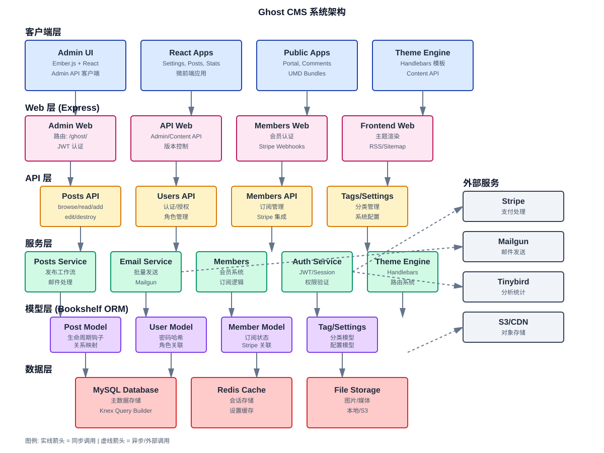

# Ghost CMS 架构文档

## 📋 目录

- [系统架构概览](#系统架构概览)
- [核心组件](#核心组件)
- [技术栈](#技术栈)
- [部署架构](#部署架构)
- [扩展机制](#扩展机制)

---

## 系统架构概览



Ghost CMS 采用经典的分层架构设计，从上到下分为六个主要层次：

### 架构层次

```
┌─────────────────────────────────────────────────────────┐
│                      客户端层                              │
│  Admin UI | React Apps | Public Apps | Theme Engine     │
└─────────────────────────────────────────────────────────┘
                            ↓
┌─────────────────────────────────────────────────────────┐
│                       Web 层                              │
│  Admin Web | API Web | Members Web | Frontend Web      │
└─────────────────────────────────────────────────────────┘
                            ↓
┌─────────────────────────────────────────────────────────┐
│                       API 层                              │
│  Posts API | Users API | Members API | Settings API     │
└─────────────────────────────────────────────────────────┘
                            ↓
┌─────────────────────────────────────────────────────────┐
│                      服务层                               │
│  Posts Service | Email | Members | Auth | Theme Engine  │
└─────────────────────────────────────────────────────────┘
                            ↓
┌─────────────────────────────────────────────────────────┐
│                      模型层                               │
│  Post Model | User Model | Member Model | Tag Model     │
└─────────────────────────────────────────────────────────┘
                            ↓
┌─────────────────────────────────────────────────────────┐
│                      数据层                               │
│  MySQL Database | Redis Cache | File Storage            │
└─────────────────────────────────────────────────────────┘
```

---

## 核心组件

### 1. 客户端层 (Client Layer)

#### 1.1 Admin UI (Ember.js + React)

**职责**: Ghost 后台管理界面

**技术栈**:
- Ember.js (主应用框架，逐步迁移到 React)
- React (新功能模块)
- JWT 认证

**关键功能**:
- 内容管理（文章、页面）
- 用户管理
- 设置配置
- 主题管理
- 集成管理

**代码位置**: `ghost/admin/`

---

#### 1.2 React 微前端应用

**职责**: 现代化的独立功能模块

**应用列表**:
- `admin-x-settings` - 设置界面
- `admin-x-activitypub` - ActivityPub 集成
- `posts` - 文章分析
- `stats` - 站点统计

**技术栈**:
- React 18
- Vite (构建工具)
- @tanstack/react-query (数据管理)
- shade 设计系统 (shadcn/ui + Radix)

**集成方式**:
```javascript
// 构建时: apps/*/dist → ghost/core/core/built/admin/assets/*
// 运行时: Ember 动态加载 React 应用
<script src="/ghost/assets/admin-x-settings/admin-x-settings.js"></script>
```

**代码位置**: `apps/admin-x-*/`, `apps/posts/`, `apps/stats/`

---

#### 1.3 Public Apps (访客应用)

**职责**: 面向网站访客的功能组件

**应用列表**:
- `portal` - 会员门户 (登录/注册/订阅)
- `comments-ui` - 评论系统
- `signup-form` - 注册表单
- `sodo-search` - 站点搜索
- `announcement-bar` - 公告栏

**技术栈**:
- React
- UMD 打包格式
- 独立 CSS

**加载方式**:
```handlebars
{{!-- 主题中通过 ghost_head 自动注入 --}}
{{{ghost_head}}}

{{!-- 生成的脚本 --}}
<script src="/public/portal.min.js"></script>
<script src="/public/comments.min.js"></script>
```

**代码位置**: `apps/portal/`, `apps/comments-ui/`, etc.

---

#### 1.4 主题引擎 (Theme Engine)

**职责**: 网站前端渲染

**技术栈**:
- Handlebars 模板
- Content API (JSON)
- Ghost Helpers (100+ 辅助函数)

**核心概念**:
```handlebars
{{!-- 主题模板示例 --}}
{{!-- index.hbs --}}
<html>
<head>
    {{!-- Ghost 注入的脚本和样式 --}}
    {{{ghost_head}}}
</head>
<body>
    {{#foreach posts}}
        <article>
            <h2><a href="{{url}}">{{title}}</a></h2>
            <p>{{excerpt}}</p>
            {{#if feature_image}}
                
            {{/if}}
        </article>
    {{/foreach}}

    {{{ghost_foot}}}
</body>
</html>
```

**代码位置**: `ghost/core/core/frontend/`

---

### 2. Web 层 (Express Routing)

#### 2.1 Admin Web

**路由前缀**: `/ghost/`

**职责**:
- 提供 Admin UI 静态资源
- 处理 Admin API 路由
- Session 管理

**中间件链**:
```javascript
adminApp.use(bodyParser.json({limit: '50mb'}));
adminApp.use(authAdminApi);  // JWT 验证
adminApp.use(versionMatch);   // API 版本匹配
```

**代码位置**: `ghost/core/core/server/web/admin/`

---

#### 2.2 API Web

**路由前缀**:
- Admin API: `/ghost/api/admin/`
- Content API: `/ghost/api/content/`

**职责**:
- API 端点路由分发
- 请求/响应格式化
- 错误处理

**API 版本控制**:
```http
GET /ghost/api/v3/admin/posts/
GET /ghost/api/v4/content/posts/
```

**代码位置**: `ghost/core/core/server/web/api/`

---

#### 2.3 Members Web

**路由前缀**: `/members/`

**职责**:
- 会员认证（登录/注册）
- 订阅管理
- Stripe Webhook 处理

**关键端点**:
```
POST /members/api/send-magic-link  # 魔法链接登录
POST /members/api/create-stripe-checkout  # 创建支付会话
POST /members/webhooks/stripe  # Stripe 回调
```

**代码位置**: `ghost/core/core/server/web/members/`

---

#### 2.4 Frontend Web

**路由前缀**: `/` (根路径)

**职责**:
- 主题渲染
- RSS/Sitemap 生成
- 动态路由系统

**路由示例**:
```
/                    → index 集合页
/about/              → about 页面
/my-post/            → 文章详情页
/tag/news/           → 标签归档页
/author/ghost/       → 作者归档页
/rss/                → RSS feed
/sitemap.xml         → 站点地图
```

**代码位置**: `ghost/core/core/frontend/`

---

### 3. API 层 (RESTful Endpoints)

#### 3.1 Posts API

**端点**: `/ghost/api/admin/posts/`

**操作**:
- `GET /posts/` - 浏览文章列表
- `GET /posts/:id` - 读取单个文章
- `POST /posts/` - 创建文章
- `PUT /posts/:id` - 更新文章
- `DELETE /posts/:id` - 删除文章
- `POST /posts/:id/copy` - 复制文章

**查询参数**:
```
?include=tags,authors           # 包含关联资源
?filter=status:published        # NQL 过滤
?fields=title,slug              # 字段选择
?limit=15&page=2                # 分页
?order=published_at DESC        # 排序
```

**代码位置**: `ghost/core/core/server/api/endpoints/posts.js`

---

#### 3.2 Users API

**端点**: `/ghost/api/admin/users/`

**操作**:
- `GET /users/` - 用户列表
- `GET /users/:id` - 用户详情
- `PUT /users/:id` - 更新用户
- `PUT /users/password` - 修改密码
- `PUT /users/owner` - 转移所有者

**权限控制**:
- Owner - 完全控制
- Administrator - 管理权限
- Editor - 编辑权限
- Author - 作者权限
- Contributor - 投稿权限

**代码位置**: `ghost/core/core/server/api/endpoints/users.js`

---

#### 3.3 Members API

**端点**: `/ghost/api/admin/members/`

**操作**:
- `GET /members/` - 会员列表
- `POST /members/` - 创建会员
- `PUT /members/:id` - 更新会员
- `POST /members/:id/subscriptions/` - 创建订阅
- `GET /members/stats/count` - 会员统计

**Stripe 集成**:
```javascript
// 创建支付会话
POST /members/:id/subscriptions/
{
  "price_id": "price_xxx",
  "cancel_url": "https://...",
  "success_url": "https://..."
}
```

**代码位置**: `ghost/core/core/server/api/endpoints/members.js`

---

### 4. 服务层 (Business Logic)

#### 4.1 Posts Service

**职责**: 文章相关业务逻辑

**关键方法**:
```javascript
class PostsService {
    async browsePosts(options)      // 浏览文章
    async readPost(frame)            // 读取文章
    async editPost(frame, options)   // 编辑文章（含邮件处理）
    async bulkEdit(data, options)    // 批量编辑
    async export(frame)              // 导出 CSV
}
```

**特殊逻辑**:
- 邮件发送协调
- 发布工作流管理
- 定时发布调度

**代码位置**: `ghost/core/core/server/services/posts/`

---

#### 4.2 Email Service

**职责**: 邮件发送管理

**功能**:
- Newsletter 批量发送
- 事务性邮件（欢迎邮件、密码重置）
- 邮件追踪（打开率、点击率）

**提供商支持**:
- Mailgun (推荐)
- SMTP
- SendGrid (通过 SMTP)

**代码位置**: `ghost/core/core/server/services/email-service/`

---

#### 4.3 Members Service

**职责**: 会员系统核心逻辑

**功能**:
- 会员认证 (Magic Link)
- 订阅管理
- Stripe 集成
- 会员事件追踪

**Stripe Webhooks 处理**:
```javascript
async handleWebhook(event) {
    switch (event.type) {
        case 'checkout.session.completed':
            // 创建/更新订阅
        case 'customer.subscription.updated':
            // 更新订阅状态
        case 'customer.subscription.deleted':
            // 取消订阅
    }
}
```

**代码位置**: `ghost/core/core/server/services/members/`

---

#### 4.4 Auth Service

**职责**: 认证与授权

**认证方式**:
- **Admin**: JWT Token
- **Members**: Magic Link + Cookie Session
- **API Keys**: Admin Integration Keys

**权限系统**:
```javascript
// 基于角色的访问控制 (RBAC)
const permissions = {
    'post:add': ['Owner', 'Administrator', 'Editor', 'Author', 'Contributor'],
    'post:edit': ['Owner', 'Administrator', 'Editor', 'Author'],
    'post:publish': ['Owner', 'Administrator', 'Editor'],
    'post:destroy': ['Owner', 'Administrator', 'Editor']
};
```

**代码位置**: `ghost/core/core/server/services/auth/`

---

### 5. 模型层 (ORM - Bookshelf/Knex)

#### 5.1 Post Model

**表名**: `posts`

**关键字段**:
```javascript
{
    id: 'string(24)',          // ObjectID
    uuid: 'string(36)',        // UUID
    title: 'string(2000)',
    slug: 'string(191)',       // URL 友好标识
    mobiledoc: 'text',         // 旧编辑器格式
    lexical: 'text',           // 新编辑器格式
    html: 'text',              // 渲染后的 HTML
    status: 'enum',            // draft, published, scheduled, sent
    visibility: 'enum',        // public, members, paid, tiers
    created_at: 'datetime',
    published_at: 'datetime'
}
```

**关系**:
- `belongsTo` User (author)
- `belongsToMany` Tag
- `belongsToMany` User (authors)
- `belongsToMany` Product (tiers)
- `hasOne` PostsMeta
- `hasOne` Email

**生命周期钩子**:
```javascript
onCreating()  // 生成 UUID, slug
onSaving()    // 验证内容，生成 HTML
onCreated()   // 触发事件
onSaved()     // 处理关联
```

**代码位置**: `ghost/core/core/server/models/post.js`

---

#### 5.2 User Model

**表名**: `users`

**关键字段**:
```javascript
{
    id: 'string(24)',
    name: 'string(191)',
    slug: 'string(191)',
    email: 'string(191)',      // Unique
    password: 'string(60)',    // Bcrypt hash
    status: 'enum',            // active, inactive, locked
    visibility: 'enum',        // public, private
    profile_image: 'string(2000)',
    cover_image: 'string(2000)'
}
```

**关系**:
- `belongsToMany` Role
- `hasMany` Post (as author)

**安全特性**:
```javascript
// 密码哈希
async hashPassword(password) {
    const hash = await bcrypt.hash(password, 10);
    this.set('password', hash);
}

// 密码验证
async validatePassword(password) {
    return bcrypt.compare(password, this.get('password'));
}
```

**代码位置**: `ghost/core/core/server/models/user.js`

---

#### 5.3 Member Model

**表名**: `members`

**关键字段**:
```javascript
{
    id: 'string(24)',
    uuid: 'string(36)',
    email: 'string(191)',      // Unique
    name: 'string(191)',
    status: 'enum',            // free, paid, comped
    email_disabled: 'boolean',
    subscribed: 'boolean',
    created_at: 'datetime'
}
```

**关系**:
- `hasMany` MemberStripeCustomer (Stripe 关联)
- `hasMany` MemberSubscription
- `hasMany` MemberLoginEvent
- `belongsToMany` Product (tiers)
- `belongsToMany` Newsletter

**代码位置**: `ghost/core/core/server/models/member.js`

---

### 6. 数据层 (Database & Storage)

#### 6.1 MySQL Database

**数据库引擎**: MySQL 8.0+ / MariaDB 10.3+

**核心表**:
```
posts                    # 文章
users                    # 用户
members                  # 会员
tags                     # 标签
posts_tags               # 文章-标签关联
posts_authors            # 文章-作者关联
products                 # 会员产品（层级）
newsletters              # 邮件通讯
emails                   # 已发送邮件
settings                 # 系统设置
```

**索引策略**:
- 主键: ObjectID (string(24))
- 唯一索引: email, slug
- 外键索引: author_id, tag_id
- 全文索引: (未使用，使用应用层过滤)

**迁移管理**:
```bash
yarn knex-migrator migrate          # 执行迁移
yarn knex-migrator rollback         # 回滚迁移
```

**代码位置**: `ghost/core/core/server/data/schema/`

---

#### 6.2 Redis Cache

**用途**:
- Session 存储 (Admin + Members)
- 设置缓存 (settings-cache)
- 速率限制计数器
- 临时数据存储

**缓存策略**:
```javascript
// 设置缓存
const settingsCache = {
    get(key) {
        // 从内存读取，Redis 作为持久化备份
    },
    set(key, value) {
        // 写入内存和 Redis
    },
    invalidate(key) {
        // 清除缓存
    }
};
```

**代码位置**: `ghost/core/core/shared/settings-cache/`

---

#### 6.3 File Storage

**存储适配器**:
- **本地存储** (默认): `content/images/`, `content/media/`
- **S3**: AWS S3 兼容存储
- **自定义**: 可实现自定义存储适配器

**文件类型**:
```
images/      # 图片 (JPEG, PNG, WebP, GIF)
media/       # 视频/音频
files/       # 文档 (PDF, etc.)
themes/      # 主题 zip 包
data/        # 数据导入/导出
```

**URL 转换**:
```javascript
// 存储时转换为 __GHOST_URL__
mobiledoc: '{"cards":[["image",{"src":"__GHOST_URL__/content/images/2026/01/photo.jpg"}]]}'

// 读取时转换为绝对 URL
mobiledoc: '{"cards":[["image",{"src":"https://example.com/content/images/2026/01/photo.jpg"}]]}'
```

**代码位置**: `ghost/core/core/server/adapters/storage/`

---

## 技术栈

### 后端技术

| 技术 | 版本 | 用途 |
|------|------|------|
| Node.js | ^22.13.1 | 运行时 |
| Express.js | 4.21.2 | Web 框架 |
| Bookshelf.js | 1.2.0 | ORM |
| Knex.js | 2.4.2 | SQL Query Builder |
| MySQL | 8.0+ | 主数据库 |
| Redis | 6.0+ | 缓存/会话 |
| Handlebars | 4.7.8 | 模板引擎 |
| JWT | 8.5.1 | 认证 |

### 前端技术

| 技术 | 版本 | 用途 |
|------|------|------|
| React | 18.x | 现代 UI 组件 |
| Ember.js | 4.x | Admin UI (遗留) |
| Vite | 5.x | 构建工具 |
| @tanstack/react-query | 5.x | 数据管理 |
| Radix UI | 1.x | 无样式组件库 |
| Tailwind CSS | 3.x | 工具类 CSS |

### 外部服务

| 服务 | 用途 |
|------|------|
| Stripe | 支付处理 |
| Mailgun | 邮件发送 |
| Tinybird | 分析统计 |
| S3/CDN | 对象存储 |
| Sentry | 错误追踪 |

---

## 部署架构

### 标准部署

```
┌─────────────────────────────────────────┐
│           Load Balancer (Nginx)         │
│         SSL Termination + Caching       │
└─────────────────────────────────────────┘
                    ↓
┌─────────────────────────────────────────┐
│         Ghost Application Server        │
│            (Node.js Process)            │
│                                         │
│  ┌────────────┐      ┌──────────────┐  │
│  │  Admin UI  │      │  Frontend    │  │
│  │  (Ember +  │      │  (Themes)    │  │
│  │   React)   │      │              │  │
│  └────────────┘      └──────────────┘  │
└─────────────────────────────────────────┘
          ↓                    ↓
┌──────────────────┐  ┌────────────────┐
│  MySQL Database  │  │  Redis Cache   │
└──────────────────┘  └────────────────┘
          ↓
┌──────────────────┐
│  File Storage    │
│  (Local/S3)      │
└──────────────────┘
```

### 高可用部署

```
                    ┌─────────────┐
                    │   CDN       │
                    │  (Cloudflare│
                    │   /Fastly)  │
                    └─────────────┘
                          ↓
              ┌───────────────────────┐
              │   Load Balancer       │
              │   (Nginx/HAProxy)     │
              └───────────────────────┘
                    ↓         ↓
        ┌─────────────┐   ┌─────────────┐
        │  Ghost App  │   │  Ghost App  │
        │  Instance 1 │   │  Instance 2 │
        └─────────────┘   └─────────────┘
              ↓                 ↓
        ┌──────────────────────────────┐
        │   MySQL Primary (RW)         │
        │   + Replica (RO)             │
        └──────────────────────────────┘
              ↓                 ↓
        ┌──────────────────────────────┐
        │   Redis Cluster              │
        └──────────────────────────────┘
              ↓
        ┌──────────────────────────────┐
        │   S3 Object Storage          │
        └──────────────────────────────┘
```

---

## 扩展机制

### 1. 自定义主题

**位置**: `content/themes/`

**结构**:
```
my-theme/
├── package.json          # 主题元数据
├── index.hbs             # 首页模板
├── post.hbs              # 文章模板
├── author.hbs            # 作者页模板
├── tag.hbs               # 标签页模板
├── partials/             # 部分模板
│   ├── header.hbs
│   └── footer.hbs
└── assets/               # 静态资源
    ├── css/
    └── js/
```

**API 集成**:
```javascript
// 在主题中使用 Content API
fetch('/ghost/api/content/posts/?key=YOUR_KEY')
    .then(res => res.json())
    .then(data => console.log(data.posts));
```

---

### 2. 自定义集成 (Integrations)

**Admin API Key**:
```javascript
// 创建集成获得 API Key
const GhostAdminAPI = require('@tryghost/admin-api');

const api = new GhostAdminAPI({
    url: 'https://demo.ghost.io',
    key: 'YOUR_ADMIN_API_KEY',
    version: 'v5.0'
});

// 创建文章
await api.posts.add({
    title: 'My Post',
    status: 'published'
});
```

---

### 3. Webhooks

**事件类型**:
- `post.published`
- `post.unpublished`
- `member.added`
- `member.deleted`
- `subscriber.added`

**配置**:
```json
{
  "event": "post.published",
  "target_url": "https://your-server.com/webhook",
  "secret": "your_secret_key"
}
```

**接收**:
```javascript
app.post('/webhook', (req, res) => {
    const signature = req.headers['x-ghost-signature'];
    const body = req.body;

    // 验证签名
    const expectedSignature = crypto
        .createHmac('sha256', secret)
        .update(JSON.stringify(body))
        .digest('hex');

    if (signature === `sha256=${expectedSignature}`) {
        // 处理 webhook
        console.log('Post published:', body.post.current.title);
    }

    res.sendStatus(200);
});
```

---

### 4. 自定义存储适配器

**实现接口**:
```javascript
const BaseAdapter = require('ghost-storage-base');

class MyStorageAdapter extends BaseAdapter {
    async save(file, targetDir) {
        // 保存文件到自定义存储
        return 'https://cdn.example.com/path/to/file.jpg';
    }

    async exists(fileName, targetDir) {
        // 检查文件是否存在
        return true;
    }

    async serve() {
        // 返回 Express 静态文件中间件
        return (req, res, next) => next();
    }

    async delete(fileName, targetDir) {
        // 删除文件
        return true;
    }

    async read(options) {
        // 读取文件
        return Buffer.from('...');
    }
}

module.exports = MyStorageAdapter;
```

---

## 性能优化

### 1. 缓存策略

**层级缓存**:
```
Browser Cache (CDN)
    ↓
Redis Cache (Settings)
    ↓
Database
```

**缓存配置**:
```javascript
// 静态资源 - 1 年
res.set('Cache-Control', 'public, max-age=31536000, immutable');

// 文章页面 - 10 分钟
res.set('Cache-Control', 'public, max-age=600');

// Admin API - 不缓存
res.set('Cache-Control', 'private, no-cache');
```

---

### 2. 数据库优化

**查询优化**:
```javascript
// ❌ N+1 查询问题
const posts = await Post.findAll();
for (const post of posts) {
    const author = await post.author().fetch();  // N 次查询
}

// ✅ Eager Loading
const posts = await Post.findAll({
    withRelated: ['author', 'tags']  // 1 次查询
});
```

**索引使用**:
```sql
-- 确保常用查询有索引
CREATE INDEX idx_posts_status ON posts(status);
CREATE INDEX idx_posts_published_at ON posts(published_at);
CREATE INDEX idx_members_email ON members(email);
```

---

### 3. 并发处理

**批量操作**:
```javascript
// 批量发送邮件
const batches = chunk(members, 1000);

for (const batch of batches) {
    await Promise.all(
        batch.map(member => emailService.send(member))
    );
}
```

---

## 安全措施

### 1. 认证安全

- ✅ JWT Token 短期有效（12 小时）
- ✅ Bcrypt 密码哈希（10 rounds）
- ✅ 魔法链接一次性使用
- ✅ Session 固定时长

### 2. 授权控制

- ✅ 基于角色的访问控制 (RBAC)
- ✅ 资源级权限检查
- ✅ API Key 权限隔离

### 3. 输入验证

- ✅ JSON Schema 验证
- ✅ SQL 注入防护 (参数化查询)
- ✅ XSS 防护 (HTML 清理)
- ✅ CSRF 防护 (Token)

### 4. 速率限制

```javascript
// 登录限制: 5 次/小时
// API 限制: 1000 次/小时
// 邮件发送: 按会员数量
```

---

## 监控与日志

### 日志级别

```javascript
logging.error()   // 错误
logging.warn()    // 警告
logging.info()    // 信息
logging.debug()   // 调试 (DEBUG=ghost:* 启用)
```

### 性能监控

```javascript
metrics.metric('post.create.duration', duration);
metrics.metric('email.send.count', count);
metrics.metric('api.request.latency', latency);
```

### 错误追踪

- Sentry 集成
- 错误堆栈捕获
- 上下文信息收集

---

## 附录

### A. 配置文件

**config.production.json**:
```json
{
  "url": "https://example.com",
  "database": {
    "client": "mysql",
    "connection": {
      "host": "localhost",
      "user": "ghost",
      "password": "secret",
      "database": "ghost_prod"
    }
  },
  "mail": {
    "transport": "SMTP",
    "options": {
      "service": "Mailgun",
      "auth": {
        "user": "postmaster@...",
        "pass": "..."
      }
    }
  },
  "storage": {
    "active": "s3",
    "s3": {
      "accessKeyId": "...",
      "secretAccessKey": "...",
      "bucket": "my-ghost-bucket",
      "region": "us-east-1"
    }
  }
}
```

### B. 环境变量

```bash
NODE_ENV=production
database__connection__host=localhost
database__connection__user=ghost
database__connection__password=secret
database__connection__database=ghost_prod
url=https://example.com
mail__transport=SMTP
mail__options__auth__user=postmaster@...
mail__options__auth__pass=...
```

---

**文档版本**: 1.0.0
**最后更新**: 2026-01-26
**对应 Ghost 版本**: 6.14.0
