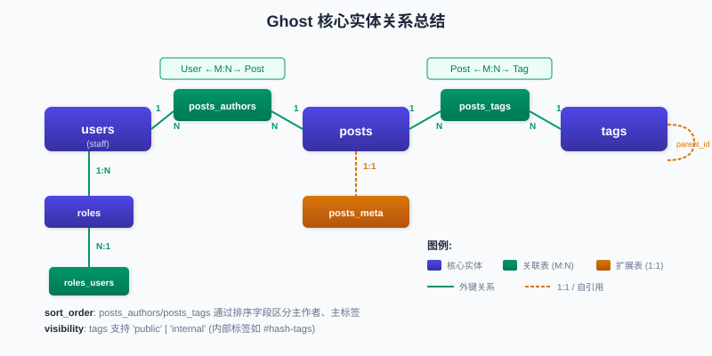
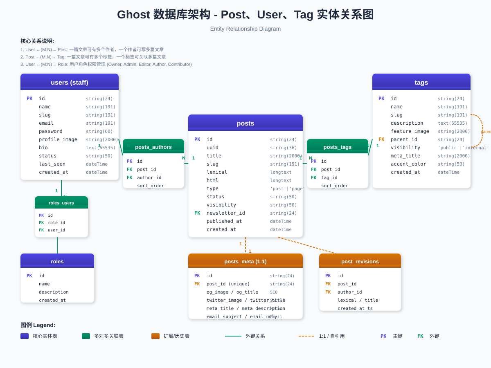

# Ghost 数据库架构分析：Post、User、Tag 关系

## 概述

Ghost 使用 MySQL 数据库，采用 Knex.js 作为查询构建器。本文档重点分析内容管理核心的三个实体：**Post（文章）**、**User（用户/作者）**、**Tag（标签）** 之间的关系。

## 核心实体

### 1. Posts（文章表）

**位置**: `ghost/core/core/server/data/schema/schema.js` 第 61-105 行

```
posts
├── id (string[24], PK)
├── uuid (string[36], unique, indexed)
├── title (string[2000])
├── slug (string[191], unique with type)
├── mobiledoc / lexical (longtext) - 编辑器内容
├── html / plaintext (longtext) - 渲染后内容
├── type: 'post' | 'page'
├── status: 'draft' | 'published' | 'scheduled' | 'sent'
├── visibility (string[50])
├── newsletter_id → newsletters.id (FK)
├── published_by (string[24]) - 发布者 ID
├── created_at / updated_at / published_at
└── [其他元数据字段]
```

**关键特点**:
- `type` 字段区分文章(post)和页面(page)
- `slug + type` 组成唯一约束
- 支持 Mobiledoc 和 Lexical 两种编辑器格式
- `published_by` 存储发布者 ID，但无外键约束（软引用）

### 2. Users（用户/员工表）

**位置**: `ghost/core/core/server/data/schema/schema.js` 第 123-186 行

```
users (NOTE: 这是 staff 表，非会员表)
├── id (string[24], PK)
├── name (string[191])
├── slug (string[191], unique)
├── email (string[191], unique)
├── password (string[60])
├── profile_image / cover_image (string[2000])
├── bio / website / location
├── 社交媒体链接 (facebook, twitter, threads, bluesky 等)
├── status: 'active' | 'inactive' | 'locked' | 'warn-1~4'
├── visibility: 'public'
├── 通知设置 (comment_notifications, milestone_notifications 等)
├── last_seen (dateTime)
└── created_at / updated_at
```

**关键特点**:
- 这是**管理后台用户**（作者、编辑、管理员），不是前台会员(members)
- 支持丰富的社交媒体链接
- 包含多种通知偏好设置
- `status` 支持多级警告状态用于安全控制

### 3. Tags（标签表）

**位置**: `ghost/core/core/server/data/schema/schema.js` 第 268-296 行

```
tags
├── id (string[24], PK)
├── name (string[191], 不允许逗号)
├── slug (string[191], unique)
├── description (text[65535])
├── feature_image (string[2000])
├── parent_id (string, nullable) - 支持层级结构
├── visibility: 'public' | 'internal'
├── SEO 元数据 (og_*, twitter_*, meta_*)
├── codeinjection_head / codeinjection_foot
├── accent_color (string[50])
└── created_at / updated_at
```

**关键特点**:
- `parent_id` 支持标签层级（目前未广泛使用）
- `visibility: internal` 用于内部标签（如 `#hash-tags`）
- 支持独立的 SEO 和代码注入设置

## 关系表（多对多）

### posts_authors（文章-作者关联）

**位置**: 第 187-192 行

```
posts_authors
├── id (string[24], PK)
├── post_id → posts.id (FK)
├── author_id → users.id (FK)
└── sort_order (integer, unsigned, default: 0)
```

**业务含义**:
- 一篇文章可以有**多个作者**（共同作者功能）
- 一个用户可以是**多篇文章**的作者
- `sort_order` 决定作者显示顺序（第一作者、第二作者等）

### posts_tags（文章-标签关联）

**位置**: 第 297-305 行

```
posts_tags
├── id (string[24], PK)
├── post_id → posts.id (FK)
├── tag_id → tags.id (FK)
├── sort_order (integer, unsigned, default: 0)
└── @@INDEXES@@: [post_id, tag_id]
```

**业务含义**:
- 一篇文章可以有**多个标签**
- 一个标签可以关联**多篇文章**
- `sort_order` 决定标签显示顺序（主标签排第一位）
- 复合索引优化查询性能

## 扩展实体

### posts_meta（文章元数据）

**位置**: 第 106-122 行

```
posts_meta (1:1 关系)
├── id (string[24], PK)
├── post_id → posts.id (FK, unique)
├── og_image / og_title / og_description
├── twitter_image / twitter_title / twitter_description
├── meta_title / meta_description
├── email_subject
├── frontmatter
├── feature_image_alt / feature_image_caption
└── email_only (boolean)
```

**关系类型**: 一对一（post_id 有唯一约束）

### post_revisions（文章修订历史）

**位置**: 第 402-416 行

```
post_revisions
├── id (string[24], PK)
├── post_id → posts.id (FK, indexed)
├── lexical (longtext) - 内容快照
├── author_id → users.id (FK) - 修改者
├── title / post_status / reason
├── feature_image 相关字段
├── custom_excerpt
└── created_at / created_at_ts
```

**业务含义**:
- 记录文章的历史版本
- 跟踪谁(`author_id`)做了什么修改(`reason`)
- 支持版本回滚功能

### roles_users（角色-用户关联）

**位置**: 第 200-204 行

```
roles_users
├── id (string[24], PK)
├── role_id (string[24])
└── user_id (string[24])
```

**业务含义**:
- 用户可以拥有多个角色
- 常见角色：Owner, Administrator, Editor, Author, Contributor

## 关系图总结

### 核心实体关系图



### 完整实体关系图



## 关键查询模式

### 1. 获取文章及其作者
```sql
SELECT p.*, u.name as author_name
FROM posts p
JOIN posts_authors pa ON p.id = pa.post_id
JOIN users u ON pa.author_id = u.id
WHERE pa.sort_order = 0  -- 主作者
ORDER BY p.published_at DESC;
```

### 2. 获取文章及其所有标签
```sql
SELECT p.*, GROUP_CONCAT(t.name ORDER BY pt.sort_order) as tags
FROM posts p
LEFT JOIN posts_tags pt ON p.id = pt.post_id
LEFT JOIN tags t ON pt.tag_id = t.id
WHERE p.status = 'published'
GROUP BY p.id;
```

### 3. 按标签查找文章
```sql
SELECT p.*
FROM posts p
JOIN posts_tags pt ON p.id = pt.post_id
JOIN tags t ON pt.tag_id = t.id
WHERE t.slug = 'technology'
  AND p.status = 'published'
  AND p.type = 'post'
ORDER BY p.published_at DESC;
```

### 4. 获取用户的所有文章
```sql
SELECT p.*
FROM posts p
JOIN posts_authors pa ON p.id = pa.post_id
WHERE pa.author_id = 'user_id_here'
ORDER BY p.published_at DESC;
```

## 设计特点分析

### 优点
1. **灵活的多作者支持** - `posts_authors` 中间表支持共同作者，`sort_order` 区分主次
2. **标签层级预留** - `tags.parent_id` 为未来功能预留扩展空间
3. **内部标签机制** - `visibility: internal` 支持系统级标签不对外展示
4. **版本控制** - `post_revisions` 表保留完整修改历史
5. **元数据分离** - `posts_meta` 分离 SEO 和社交分享数据，保持主表简洁

### 设计决策
1. **字符串 ID** - 使用 24 字符的 ObjectId 风格 ID，非自增整数
2. **软删除** - 无 deleted_at 字段，依赖 status 管理生命周期
3. **published_by 软引用** - 无外键约束，允许用户删除后保留发布记录
4. **双编辑器支持** - `mobiledoc` 和 `lexical` 并存，支持迁移过渡

## 相关代码位置

| 组件 | 路径 |
|------|------|
| Schema 定义 | `ghost/core/core/server/data/schema/schema.js` |
| Post Model | `ghost/core/core/server/models/post.js` |
| User Model | `ghost/core/core/server/models/user.js` |
| Tag Model | `ghost/core/core/server/models/tag.js` |
| API 端点 | `ghost/core/core/server/api/endpoints/posts.js` |
| 迁移脚本 | `ghost/core/core/server/data/migrations/versions/` |
