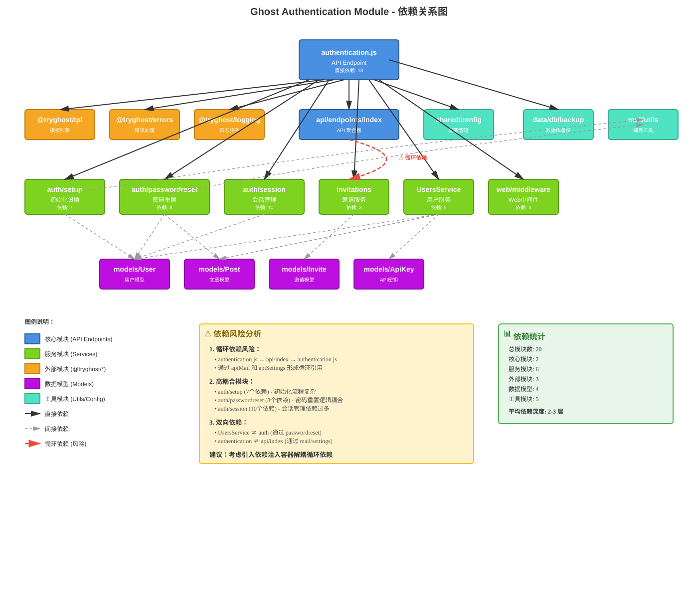

# Ghost Authentication 模块依赖关系分析

## 📋 目录

1. [模块概览](#模块概览)
2. [直接依赖分析](#直接依赖分析)
3. [依赖关系图](#依赖关系图)
4. [调用链分析](#调用链分析)
5. [循环依赖识别](#循环依赖识别)
6. [风险评估](#风险评估)
7. [优化建议](#优化建议)

---

## 模块概览

**分析目标**: `ghost/core/core/server/api/endpoints/authentication.js`

**模块职责**: Ghost 认证系统的 API 端点控制器，负责处理用户认证相关的所有操作。

**代码位置**: `/ghost/core/core/server/api/endpoints/authentication.js` (220 行)

**主要功能**:
- ✅ 初始化设置 (setup)
- ✅ 更新设置 (updateSetup)
- ✅ 检查设置状态 (isSetup)
- ✅ 生成密码重置令牌 (generateResetToken)
- ✅ 重置密码 (resetPassword)
- ✅ 接受邀请 (acceptInvitation)
- ✅ 检查邀请状态 (isInvitation)
- ✅ 重置所有密码 (resetAllPasswords)

---

## 直接依赖分析

### 1. 外部依赖 (External Modules)

| 模块 | 版本 | 用途 | 使用位置 |
|------|------|------|----------|
| `@tryghost/tpl` | - | 模板字符串国际化 | 错误消息处理 (L3, L18, L90) |
| `@tryghost/errors` | - | 统一错误处理 | 权限验证、异常抛出 (L4, L90) |
| `@tryghost/logging` | - | 日志记录服务 | 邮件发送失败日志 (L5, L76) |

**依赖特点**:
- 全部来自 Ghost 官方包 (`@tryghost/*`)
- 无第三方外部依赖
- 符合 Ghost 架构规范

---

### 2. 核心模块依赖 (Core Modules)

#### 2.1 API 聚合器
```javascript
const api = require('./index');                    // L1
const apiMail = require('./index').mail;           // L11
const apiSettings = require('./index').settings;   // L12
```

**依赖关系**:
- `authentication.js` → `api/endpoints/index.js` → `authentication.js` ⚠️
- **循环依赖风险**: 通过 `api.mail` 和 `api.settings` 形成循环引用

**使用场景**:
- `api.settings`: 读取/更新站点设置 (L71, L105, L108)
- `api.mail`: 发送欢迎邮件、密码重置邮件 (L74, L143)
- `api.themes`: 安装主题 (L68)
- `api.tiers`: 更新产品信息 (L62)
- `api.newsletters`: 更新新闻通讯 (L62)

---

#### 2.2 配置模块
```javascript
const config = require('../../../shared/config');  // L2
```

**用途**:
- 读取站点配置信息 (L122-124)
- 提供初始化默认值

**访问的配置项**:
- `config.title`: 站点标题
- `config.user_name`: 默认用户名
- `config.user_email`: 默认邮箱

---

### 3. 服务层依赖 (Service Modules)

#### 3.1 认证服务 (auth)
```javascript
const auth = require('../../services/auth');       // L8
```

**子模块结构**:
```
auth/
├── setup.js           (初始化设置)
├── passwordreset.js   (密码重置)
├── session/           (会话管理)
├── authenticate.js    (身份验证)
└── authorize.js       (权限授权)
```

**调用关系**:
- `auth.setup.assertSetupCompleted()` - 验证设置状态 (L37, L97, L141, L163, L183, L200)
- `auth.setup.setupUser()` - 创建/更新用户 (L51, L107)
- `auth.setup.doFixtures()` - 初始化固定数据 (L55)
- `auth.setup.doProductAndNewsletter()` - 设置产品和新闻通讯 (L62)
- `auth.setup.installTheme()` - 安装主题 (L68)
- `auth.setup.doSettings()` - 更新设置 (L71, L108)
- `auth.setup.sendWelcomeEmail()` - 发送欢迎邮件 (L74)
- `auth.passwordreset.generateToken()` - 生成重置令牌 (L142)
- `auth.passwordreset.sendResetNotification()` - 发送重置通知 (L143)
- `auth.passwordreset.extractTokenParts()` - 解析令牌 (L164)
- `auth.passwordreset.protectBruteForce()` - 防暴力破解 (L165)
- `auth.passwordreset.doReset()` - 执行密码重置 (L168)

**依赖深度**: 2-3 层

---

#### 3.2 邀请服务 (invitations)
```javascript
const invitations = require('../../services/invitations'); // L9
```

**功能**: 处理用户邀请逻辑

**调用**:
- `invitations.accept()` - 接受邀请 (L184)

**依赖模块**:
- `invitations/accept.js` - 邀请接受逻辑

---

#### 3.3 用户服务 (UsersService)
```javascript
const UsersService = require('../../services/users');      // L13
const userService = new UsersService({
    dbBackup, models, auth, apiMail, apiSettings
});                                                         // L14
```

**依赖注入**:
- `dbBackup`: 数据库备份服务
- `models`: 数据模型
- `auth`: 认证服务 ⚠️ (双向依赖)
- `apiMail`: 邮件 API
- `apiSettings`: 设置 API

**调用**:
- `userService.resetAllPasswords()` - 重置所有用户密码 (L213)

**风险**: 与 `auth` 服务形成双向依赖

---

#### 3.4 会话服务 (session)
```javascript
const {deleteAllSessions} = require('../../services/auth/session'); // L15
```

**功能**: 会话管理

**调用**:
- `deleteAllSessions()` - 删除所有会话 (L214)

**使用场景**: 重置所有密码后清除会话

---

### 4. 数据层依赖 (Data Layer)

#### 4.1 数据模型 (models)
```javascript
const models = require('../../models');            // L7
```

**使用的模型**:
- `models.User`: 用户模型
  - `findOne()` - 查找所有者用户 (L88)
  - `isSetup()` - 检查是否已设置 (间接调用)
  - `setup()` - 初始化用户 (间接调用)

- `models.Invite`: 邀请模型
  - `findOne()` - 查找邀请记录 (L202)

**调用位置**:
- L88: 查找所有者用户进行权限验证
- L202: 检查邀请状态

---

#### 4.2 数据库备份 (dbBackup)
```javascript
const dbBackup = require('../../data/db/backup'); // L10
```

**用途**: 在重置密码前备份数据库

**注入到**: `UsersService` 构造函数

---

### 5. Web 层依赖 (Web Layer)

```javascript
const web = require('../../web');                  // L6
```

**使用**:
- `web.shared.middleware.api.spamPrevention.userLogin()` - 防垃圾邮件中间件 (L169)

**功能**: 重置密码成功后重置登录尝试计数器

---

## 依赖关系图



**图表说明**:
- 🔵 **蓝色节点**: 核心 API 模块
- 🟢 **绿色节点**: 服务层模块
- 🟠 **橙色节点**: 外部依赖包
- 🟣 **紫色节点**: 数据模型层
- 🔷 **青色节点**: 工具和配置模块
- **实线箭头**: 直接依赖关系
- **虚线箭头**: 间接依赖关系
- **红色箭头**: 循环依赖（风险点）

---

## 调用链分析

### 1. 初始化设置流程 (setup)

```
用户请求 POST /ghost/api/admin/authentication/setup
    ↓
authentication.setup.query()
    ↓
auth.setup.assertSetupCompleted(false)
    ↓
auth.setup.setupUser(setupDetails)
    ├→ models.User.findOne({role: 'Owner'})
    └→ models.User.setup(userData)
    ↓
auth.setup.doFixtures(data)
    └→ models.Post.findOne() & models.Post.edit()
    ↓
auth.setup.doProductAndNewsletter(data, api)
    ├→ api.tiers.browse() & api.tiers.edit()
    └→ api.newsletters.browse() & api.newsletters.edit()
    ↓
auth.setup.installTheme(data, api)
    ├→ api.themes.install()
    └→ api.themes.activate()
    ↓
auth.setup.doSettings(data, api.settings)
    └→ api.settings.edit()
    ↓
auth.setup.sendWelcomeEmail(email, api.mail)
    ├→ mail.utils.generateContent()
    └→ api.mail.send()
```

**依赖深度**: 4-5 层
**关键路径**: 初始化 → 创建用户 → 设置数据 → 安装主题 → 更新配置 → 发送邮件

---

### 2. 密码重置流程 (resetPassword)

```
用户请求 POST /ghost/api/admin/authentication/passwordreset
    ↓
authentication.resetPassword.query()
    ↓
auth.setup.assertSetupCompleted(true)
    ↓
auth.passwordreset.extractTokenParts(frame)
    └→ security.url.decodeBase64()
    └→ security.tokens.resetToken.extract()
    ↓
auth.passwordreset.protectBruteForce(params)
    └→ 检查 tokenSecurity 暴力破解计数
    ↓
auth.passwordreset.doReset(options, tokenParts, api.settings)
    ├→ api.settings.read({key: 'db_hash'})
    ├→ models.User.getByEmail(email)
    ├→ security.tokens.resetToken.compare()
    ├→ models.User.changePassword()
    ├→ user.save()
    └→ otp.generate() (生成 2FA 绕过令牌)
    ↓
web.shared.middleware.api.spamPrevention.userLogin().reset()
```

**依赖深度**: 3-4 层
**安全机制**: 令牌验证 → 暴力破解保护 → 密码更改 → 会话重置

---

### 3. 重置所有密码流程 (resetAllPasswords)

```
管理员请求 POST /ghost/api/admin/authentication/reset_all_passwords
    ↓
authentication.resetAllPasswords.query()
    ↓
userService.resetAllPasswords(frameOptions)
    ├→ models.Base.transaction() [开启事务]
    ├→ models.User.findAll()
    ├→ user.save({status: 'locked'}) [锁定所有用户]
    ├→ auth.passwordreset.generateToken() [为每个用户生成令牌]
    │   ├→ api.settings.read({key: 'db_hash'})
    │   ├→ models.User.getByEmail()
    │   └→ security.tokens.resetToken.generateHash()
    └→ auth.passwordreset.sendResetNotification() [发送重置邮件]
        ├→ mail.utils.generateContent()
        └→ api.mail.send()
    ↓
deleteAllSessions() [清除所有会话]
    └→ expressSession.deleteAllSessions()
```

**依赖深度**: 4-5 层
**事务保护**: 整个流程在数据库事务中执行，确保原子性

---

## 循环依赖识别

### ⚠️ 循环依赖 #1: API 聚合器循环

**依赖路径**:
```
authentication.js (L1, L11, L12)
    ↓ require('./index')
api/endpoints/index.js (L12)
    ↓ require('./authentication')
authentication.js
```

**形成原因**:
- `authentication.js` 需要访问 `api.mail` 和 `api.settings`
- `api/endpoints/index.js` 作为聚合器导出所有 API 端点，包括 `authentication`

**影响分析**:
- ✅ **运行时安全**: Node.js 的 `require` 缓存机制避免了无限循环
- ⚠️ **初始化顺序**: 可能导致部分模块在初始化时未完全加载
- ⚠️ **测试困难**: 单元测试时难以 mock 依赖
- ⚠️ **代码理解**: 增加代码理解难度，违反单向依赖原则

**触发场景**:
```javascript
// authentication.js 加载时
const api = require('./index');  // 此时 index.js 开始加载
// index.js 中
get authentication() {
    return require('./authentication');  // 循环！
}
```

---

### ⚠️ 循环依赖 #2: UsersService 双向依赖

**依赖路径**:
```
authentication.js (L13-14)
    ↓ new UsersService({auth, ...})
UsersService (L73-74)
    ↓ this.auth.passwordreset.generateToken()
    ↓ this.auth.passwordreset.sendResetNotification()
auth/passwordreset.js
    ↓ (间接通过 api.settings 回到 authentication)
```

**形成原因**:
- `authentication.js` 创建 `UsersService` 实例时注入 `auth` 服务
- `UsersService.resetAllPasswords()` 调用 `auth.passwordreset` 方法
- `auth.passwordreset` 需要 `api.settings`，而 `api.settings` 通过 `index.js` 关联到 `authentication`

**影响分析**:
- ⚠️ **紧耦合**: 两个服务相互依赖，难以独立测试和维护
- ⚠️ **职责不清**: `UsersService` 应该是高层服务，但依赖底层 `auth` 服务
- ✅ **依赖注入**: 使用构造函数注入，一定程度上缓解了问题

---

### ⚠️ 潜在循环依赖 #3: Models 间接循环

**依赖路径**:
```
authentication.js
    ↓ auth.setup.setupUser()
auth/setup.js (L74)
    ↓ models.User.setup()
models/User.js
    ↓ (可能触发 hooks/events)
services/*/
    ↓ (可能回调到 authentication 相关逻辑)
```

**风险等级**: 🟡 中等

**说明**:
- 数据模型的生命周期钩子可能触发服务层回调
- 目前未发现明确的循环路径，但架构上存在风险

---

## 风险评估

### 1. 高风险项 (🔴 Critical)

#### 1.1 API 聚合器循环依赖
**风险等级**: 🔴 高
**影响范围**: 整个认证模块
**问题描述**:
- `authentication.js` 与 `api/endpoints/index.js` 形成循环依赖
- 违反单向依赖原则，增加系统复杂度

**潜在问题**:
- 模块初始化顺序不确定
- 单元测试困难，需要复杂的 mock 设置
- 重构风险高，牵一发而动全身

**建议优先级**: P0 (立即处理)

---

#### 1.2 UsersService 双向依赖
**风险等级**: 🔴 高
**影响范围**: 用户管理和认证服务
**问题描述**:
- `UsersService` 依赖 `auth` 服务
- `auth` 服务通过 API 间接依赖 `authentication`
- 形成双向依赖关系

**潜在问题**:
- 职责边界模糊
- 难以独立测试和维护
- 扩展性受限

**建议优先级**: P0 (立即处理)

---

### 2. 中风险项 (🟡 Medium)

#### 2.1 过深的依赖链
**风险等级**: 🟡 中
**影响范围**: 初始化设置流程
**问题描述**:
- `setup` 流程依赖深度达到 4-5 层
- 涉及多个 API 调用和数据库操作

**潜在问题**:
- 错误传播路径长，调试困难
- 性能开销大，初始化时间长
- 事务管理复杂

**建议优先级**: P1 (短期内处理)

---

#### 2.2 服务层高耦合
**风险等级**: 🟡 中
**影响范围**: auth/setup, auth/passwordreset, auth/session
**问题描述**:
- `auth/setup` 有 7 个直接依赖
- `auth/passwordreset` 有 8 个直接依赖
- `auth/session` 有 10 个直接依赖

**潜在问题**:
- 单一职责原则违反
- 修改影响范围大
- 测试覆盖困难

**建议优先级**: P1 (短期内处理)

---

### 3. 低风险项 (🟢 Low)

#### 3.1 外部依赖管理
**风险等级**: 🟢 低
**影响范围**: 错误处理、日志、模板
**问题描述**:
- 所有外部依赖来自 `@tryghost/*` 包
- 版本管理统一

**优点**:
- ✅ 无第三方依赖风险
- ✅ 版本控制统一
- ✅ 符合 Ghost 架构规范

**建议优先级**: P3 (持续监控)

---

## 优化建议

### 方案 1: 引入依赖注入容器 (推荐)

**目标**: 解决循环依赖和双向依赖问题

**实施步骤**:

#### 步骤 1: 创建 DI 容器
```javascript
// server/services/container.js
class ServiceContainer {
    constructor() {
        this.services = new Map();
        this.factories = new Map();
    }

    register(name, factory) {
        this.factories.set(name, factory);
    }

    get(name) {
        if (!this.services.has(name)) {
            const factory = this.factories.get(name);
            this.services.set(name, factory(this));
        }
        return this.services.get(name);
    }
}

module.exports = new ServiceContainer();
```

#### 步骤 2: 注册服务
```javascript
// server/services/bootstrap.js
const container = require('./container');

container.register('auth.setup', (c) => require('./auth/setup'));
container.register('auth.passwordreset', (c) => require('./auth/passwordreset'));
container.register('mail', (c) => require('./mail'));
container.register('settings', (c) => require('../api/endpoints/settings'));
```

#### 步骤 3: 重构 authentication.js
```javascript
// 修改前
const api = require('./index');
const auth = require('../../services/auth');

// 修改后
const container = require('../../services/container');
const auth = container.get('auth');
const mailAPI = container.get('mail');
const settingsAPI = container.get('settings');
```

**优点**:
- ✅ 彻底解决循环依赖
- ✅ 提高可测试性
- ✅ 依赖关系清晰可见
- ✅ 支持懒加载

**缺点**:
- ⚠️ 需要重构现有代码
- ⚠️ 学习成本

**工作量**: 3-5 天
**优先级**: P0

---

### 方案 2: 拆分 API 聚合器

**目标**: 打破 `api/endpoints/index.js` 的循环依赖

**实施步骤**:

#### 步骤 1: 创建独立的 API 工厂
```javascript
// server/api/factory.js
module.exports = {
    getMail() {
        return require('./endpoints/mail');
    },
    getSettings() {
        return require('./endpoints/settings');
    },
    getThemes() {
        return require('./endpoints/themes');
    }
};
```

#### 步骤 2: 重构 authentication.js
```javascript
// 修改前
const api = require('./index');
const apiMail = require('./index').mail;

// 修改后
const apiFactory = require('../factory');
const apiMail = apiFactory.getMail();
const apiSettings = apiFactory.getSettings();
```

**优点**:
- ✅ 打破循环依赖
- ✅ 改动范围小
- ✅ 向后兼容

**缺点**:
- ⚠️ 治标不治本
- ⚠️ 仍需要手动管理依赖

**工作量**: 1-2 天
**优先级**: P1

---

### 方案 3: 服务层解耦

**目标**: 降低服务层耦合度

**实施步骤**:

#### 步骤 1: 拆分 auth/setup.js
```javascript
// 当前: auth/setup.js (238 行, 7 个依赖)
// 拆分为:
// - auth/setup/core.js (用户设置核心逻辑)
// - auth/setup/fixtures.js (固定数据初始化)
// - auth/setup/theme.js (主题安装)
// - auth/setup/settings.js (设置更新)
// - auth/setup/email.js (欢迎邮件)
```

#### 步骤 2: 使用组合模式
```javascript
// auth/setup/index.js
const core = require('./core');
const fixtures = require('./fixtures');
const theme = require('./theme');
const settings = require('./settings');
const email = require('./email');

module.exports = {
    assertSetupCompleted: core.assertSetupCompleted,
    setupUser: core.setupUser,
    doFixtures: fixtures.doFixtures,
    installTheme: theme.installTheme,
    doSettings: settings.doSettings,
    sendWelcomeEmail: email.sendWelcomeEmail
};
```

**优点**:
- ✅ 单一职责原则
- ✅ 降低单个文件复杂度
- ✅ 提高可维护性
- ✅ 便于单元测试

**缺点**:
- ⚠️ 文件数量增加
- ⚠️ 需要重新组织代码

**工作量**: 2-3 天
**优先级**: P1

---

### 方案 4: 引入事件驱动架构

**目标**: 解耦服务间的直接调用

**实施步骤**:

#### 步骤 1: 定义事件
```javascript
// shared/events/authentication-events.js
module.exports = {
    USER_SETUP_COMPLETED: 'user.setup.completed',
    PASSWORD_RESET_REQUESTED: 'password.reset.requested',
    PASSWORD_RESET_COMPLETED: 'password.reset.completed'
};
```

#### 步骤 2: 发布事件
```javascript
// authentication.js - setup 方法
const events = require('../../shared/events');

async query(frame) {
    const user = await auth.setup.setupUser(setupDetails);

    // 发布事件而不是直接调用
    events.emit('user.setup.completed', {user, api});

    return user;
}
```

#### 步骤 3: 订阅事件
```javascript
// services/auth/setup-listeners.js
const events = require('../../shared/events');

events.on('user.setup.completed', async ({user, api}) => {
    await doFixtures(user);
    await installTheme(user, api);
    await sendWelcomeEmail(user.email, api.mail);
});
```

**优点**:
- ✅ 完全解耦
- ✅ 易于扩展
- ✅ 支持异步处理
- ✅ 符合领域驱动设计

**缺点**:
- ⚠️ 架构变更较大
- ⚠️ 调试复杂度增加
- ⚠️ 需要事件管理机制

**工作量**: 5-7 天
**优先级**: P2

---

### 方案对比总结

| 方案 | 解决循环依赖 | 降低耦合 | 工作量 | 风险 | 推荐度 |
|------|-------------|---------|--------|------|--------|
| 依赖注入容器 | ✅ 完全解决 | ✅ 显著降低 | 3-5天 | 🟡 中 | ⭐⭐⭐⭐⭐ |
| 拆分 API 聚合器 | ✅ 部分解决 | 🟡 有限改善 | 1-2天 | 🟢 低 | ⭐⭐⭐ |
| 服务层解耦 | 🟡 间接改善 | ✅ 显著降低 | 2-3天 | 🟢 低 | ⭐⭐⭐⭐ |
| 事件驱动架构 | ✅ 完全解决 | ✅ 完全解耦 | 5-7天 | 🔴 高 | ⭐⭐⭐⭐ |

**综合建议**:
1. **短期** (1-2周): 实施方案 2 (拆分 API 聚合器) + 方案 3 (服务层解耦)
2. **中期** (1-2月): 实施方案 1 (依赖注入容器)
3. **长期** (3-6月): 考虑方案 4 (事件驱动架构) 作为架构演进方向

---

## 总结

### 依赖统计

| 类别 | 数量 | 占比 |
|------|------|------|
| 总模块数 | 20 | 100% |
| 核心模块 | 2 | 10% |
| 服务模块 | 6 | 30% |
| 外部模块 | 3 | 15% |
| 数据模型 | 4 | 20% |
| 工具模块 | 5 | 25% |

**平均依赖深度**: 2-3 层
**最大依赖深度**: 4-5 层 (setup 流程)
**循环依赖数**: 2 个 (高风险)
**双向依赖数**: 1 个 (中风险)

---

### 关键发现

#### ✅ 优点
1. **架构清晰**: 分层明确，职责相对清晰
2. **无外部依赖**: 所有依赖来自 Ghost 官方包
3. **事务保护**: 关键操作使用数据库事务保护
4. **安全机制**: 完善的权限验证和暴力破解保护

#### ⚠️ 问题
1. **循环依赖**: API 聚合器与 authentication 形成循环
2. **双向依赖**: UsersService 与 auth 服务相互依赖
3. **高耦合**: 服务层模块依赖过多（7-10个）
4. **深度依赖链**: 初始化流程依赖深度达 4-5 层

#### 🎯 改进方向
1. **引入依赖注入**: 解决循环依赖和提高可测试性
2. **服务拆分**: 降低单个服务的复杂度
3. **接口抽象**: 定义清晰的服务接口
4. **事件驱动**: 考虑引入事件机制解耦服务

---

## 附录

### A. 完整依赖清单

#### A.1 直接依赖 (13个)

| # | 模块路径 | 类型 | 用途 |
|---|----------|------|------|
| 1 | `./index` | 核心 | API 聚合器 |
| 2 | `../../../shared/config` | 工具 | 配置管理 |
| 3 | `@tryghost/tpl` | 外部 | 模板引擎 |
| 4 | `@tryghost/errors` | 外部 | 错误处理 |
| 5 | `@tryghost/logging` | 外部 | 日志服务 |
| 6 | `../../web` | 核心 | Web 中间件 |
| 7 | `../../models` | 数据 | 数据模型 |
| 8 | `../../services/auth` | 服务 | 认证服务 |
| 9 | `../../services/invitations` | 服务 | 邀请服务 |
| 10 | `../../data/db/backup` | 工具 | 数据库备份 |
| 11 | `./index.mail` | 核心 | 邮件 API |
| 12 | `./index.settings` | 核心 | 设置 API |
| 13 | `../../services/users` | 服务 | 用户服务 |

---

#### A.2 间接依赖 (auth 服务子模块)

| # | 模块路径 | 依赖数 | 主要功能 |
|---|----------|--------|----------|
| 1 | `auth/setup.js` | 7 | 初始化设置流程 |
| 2 | `auth/passwordreset.js` | 8 | 密码重置逻辑 |
| 3 | `auth/session/index.js` | 10 | 会话管理 |
| 4 | `auth/authenticate.js` | 5 | 身份验证 |
| 5 | `auth/authorize.js` | 4 | 权限授权 |

---

#### A.3 数据模型依赖

| # | 模型 | 使用方法 | 调用位置 |
|---|------|----------|----------|
| 1 | `models.User` | `findOne()` | L88 (权限验证) |
| 2 | `models.User` | `isSetup()` | 间接 (setup 服务) |
| 3 | `models.User` | `setup()` | 间接 (setup 服务) |
| 4 | `models.User` | `getByEmail()` | 间接 (passwordreset) |
| 5 | `models.User` | `changePassword()` | 间接 (passwordreset) |
| 6 | `models.Invite` | `findOne()` | L202 (邀请检查) |
| 7 | `models.Post` | `findOne()` | 间接 (setup fixtures) |
| 8 | `models.Post` | `edit()` | 间接 (setup fixtures) |
| 9 | `models.ApiKey` | `destroy()` | 间接 (users service) |

---

### B. 方法调用统计

#### B.1 auth.setup 方法调用频率

| 方法 | 调用次数 | 调用位置 |
|------|----------|----------|
| `assertSetupCompleted()` | 6 | L37, L97, L141, L163, L183, L200 |
| `setupUser()` | 2 | L51, L107 |
| `doSettings()` | 2 | L71, L108 |
| `doFixtures()` | 1 | L55 |
| `doProductAndNewsletter()` | 1 | L62 |
| `installTheme()` | 1 | L68 |
| `sendWelcomeEmail()` | 1 | L74 |

---

#### B.2 auth.passwordreset 方法调用频率

| 方法 | 调用次数 | 调用位置 |
|------|----------|----------|
| `generateToken()` | 1 | L142 |
| `sendResetNotification()` | 1 | L143 |
| `extractTokenParts()` | 1 | L164 |
| `protectBruteForce()` | 1 | L165 |
| `doReset()` | 1 | L168 |

---

### C. 代码复杂度分析

#### C.1 方法复杂度

| 方法 | 行数 | 圈复杂度 | 依赖深度 | 风险等级 |
|------|------|----------|----------|----------|
| `setup.query()` | 46 | 8 | 4-5 | 🔴 高 |
| `updateSetup.query()` | 14 | 3 | 3 | 🟢 低 |
| `isSetup.query()` | 9 | 2 | 2 | 🟢 低 |
| `generateResetToken.query()` | 5 | 2 | 3 | 🟢 低 |
| `resetPassword.query()` | 10 | 3 | 3-4 | 🟡 中 |
| `acceptInvitation.query()` | 4 | 2 | 2 | 🟢 低 |
| `isInvitation.query()` | 5 | 2 | 2 | 🟢 低 |
| `resetAllPasswords.query()` | 4 | 2 | 4-5 | 🟡 中 |

**说明**:
- **圈复杂度**: 代码分支数量，越高越复杂
- **依赖深度**: 调用链层数
- **风险等级**: 综合评估维护风险

---

### D. 测试覆盖建议

#### D.1 单元测试优先级

| 测试场景 | 优先级 | 原因 |
|----------|--------|------|
| `setup` 流程完整性 | P0 | 核心功能，依赖链最长 |
| `resetPassword` 安全性 | P0 | 安全关键，涉及令牌验证 |
| `resetAllPasswords` 事务性 | P0 | 批量操作，需要事务保护 |
| 循环依赖场景 | P1 | 验证 require 缓存机制 |
| 权限验证逻辑 | P1 | 安全相关 |
| 邀请流程 | P2 | 相对独立 |

---

#### D.2 集成测试建议

```javascript
// 测试 setup 完整流程
describe('Authentication Setup Integration', () => {
    it('should complete full setup workflow', async () => {
        // 1. 验证未设置状态
        // 2. 执行 setup
        // 3. 验证用户创建
        // 4. 验证固定数据
        // 5. 验证主题安装
        // 6. 验证设置更新
        // 7. 验证欢迎邮件
    });
});

// 测试密码重置流程
describe('Password Reset Integration', () => {
    it('should handle complete password reset flow', async () => {
        // 1. 生成令牌
        // 2. 发送邮件
        // 3. 验证令牌
        // 4. 重置密码
        // 5. 清除会话
    });
});
```

---

### E. 性能优化建议

#### E.1 数据库查询优化

**当前问题**:
- `setup` 流程中多次独立查询
- 缺少批量操作优化

**优化方案**:
```javascript
// 优化前: 多次查询
const tier = await api.tiers.browse();
const newsletter = await api.newsletters.browse();

// 优化后: 并行查询
const [tierPage, newsletterPage] = await Promise.all([
    api.tiers.browse({limit: 'all'}),
    api.newsletters.browse({limit: 'all'})
]);
```

---

#### E.2 邮件发送优化

**当前问题**:
- 欢迎邮件发送阻塞主流程
- 失败不影响设置完成

**优化方案**:
```javascript
// 优化前: 同步等待
await auth.setup.sendWelcomeEmail(email, api.mail);

// 优化后: 异步处理
auth.setup.sendWelcomeEmail(email, api.mail)
    .catch(err => logging.error(err));
// 不等待邮件发送完成
```

---

### F. 安全加固建议

#### F.1 令牌安全

**当前实现**:
- ✅ 使用 db_hash 增强令牌安全性
- ✅ 令牌包含过期时间
- ✅ 暴力破解保护

**改进建议**:
1. 添加令牌使用次数限制
2. 实现令牌黑名单机制
3. 增加 IP 地址验证

---

#### F.2 会话管理

**当前实现**:
- ✅ 密码重置后清除所有会话
- ✅ 2FA 邮件验证令牌

**改进建议**:
1. 实现会话过期策略
2. 添加设备指纹识别
3. 异常登录检测

---

## 文档信息

**生成时间**: 2026-01-31
**分析工具**: Claude Code (Sonnet 4.5)
**文档版本**: 1.0
**Ghost 版本**: 基于当前代码库分析

**相关文档**:
- [依赖关系图](../diagrams/auth-dependency-graph.svg)
- [Ghost 架构文档](../../docs/architecture/)
- [API 参考文档](../../docs/api-reference/)

---

**分析完成** ✅

